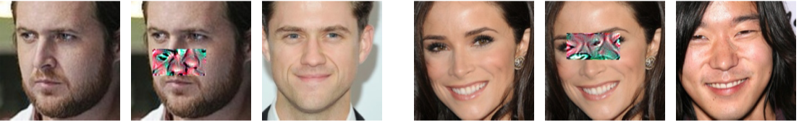

# Defending Against Physically Realizable Attacks on Image Classification

### [Tong Wu](https://tongwu2020.github.io/tongwu/), [Liang Tong](https://liang-tong.me), [Yevgeniy Vorobeychik](http://vorobeychik.com)
#### Washington University in St. Louis
 
### Paper 
[Defending Against Physically Realizable Attacks on Image Classification](https://arxiv.org/abs/1909.09552) 


## Abstract

We study the problem of defending deep neural network approaches for image classification from physically realizable attacks. First, we demonstrate that the two most scalable and effective methods for learning robust models, adversarial training with PGD attacks and randomized smoothing, exhibit very limited effectiveness against three of the highest profile physical attacks. Next, we propose a new abstract adversarial model, rectangular occlusion attacks, in which an adversary places a small adversarially crafted rectangle in an image, and develop two approaches for efficiently computing the resulting adversarial examples. Finally, we demonstrate that adversarial training using our new attack yields image classification models that exhibit high robustness against the physically realizable attacks we study, offering the first effective generic defense against such attacks.

##  Motivation

A large literature has emerged on defending deep neural networks against adversarial examples on the feature space, namely l_2, l_infty etc. However,there seems no effective methods specifically to defend against physically realizable attacks (major concern in real life).
 

## What is Physically Realizable Attack?


(a)Left three images are an example of the eyeglass frame attack. Left: original face input image. Middle: modified input image (adversarial eyeglasses superimposed on the face). Right: an image of the predicted individual with the adversarial input in the middle image. 

(b)Right three images are an example of the stop sign attack. Left: original stop sign input image. Middle: adversarial mask. Right: stop sign image with adversarial stickers, classified as a speed limit sign.

Basically, there are three characteristics.  
1. The attack can be implemented in the physical space (e.g., modifying the stop sign);
2. the attack has low suspiciousness; this is operationalized by modifying only a small part of the object, with the modification similar to common “noise” that obtains in the real world;
3. the attack causes misclassification by state-of-the-art deep neural network

## Abstract Attack Model: Rectangular Occlusion Attacks (ROA)

We introduce a rectangle which can be placed by the adversary anywhere in the image. Then the attacker can furthermore introduce l_infty noise inside the rectangle with epsilon = 255.

#### How to determine the Location of this rectangle

1. Exhaustive Searching : Adding a grey rectangular sticker to image, considering all possible locations and choosing the worst-case attack
2. Gradient Based Searching : Computing the magnitude of the gradient w.r.t each pixel, considering all possible locations and choosing C locations with largest magnitude. Exhaustively searching among these C locations.

#### Examples 



Examples of the ROA attack on face recognition, using a rectangle of size 100 × 50. 

(a) Left three images. Left: the original A. J. Buckley’s image. Middle: modified input image (ROA superimposed on the face). Right: an image of the predicted individual who is Aaron Tveit with the adversarial input in the middle image. 

(b) Right three images. Left: the original Abigail Spencer’s image. Middle: modified input image (ROA superimposed on the face). Right: an image of the predicted individual who is Aaron Yoo with the adversarial input in the middle image.

## Defense against Occlusion Attacks (DOA) & Results 

We apply the adversarial training approach for ROA to fine tune the clean model, achieving significant improvement compared to conventional robust classifers. 


## Prepare for the experiment 
1. Clone this repository: 
```
git clone https://github.com/tongwu2020/phattacks.git
```

2. Install the dependencies:
```
conda create -n phattack
conda activate phattack
# Install following packages:
# See https://pytorch.org/ for the command for your system to install correct version of Pytorch 
conda install scipy pandas statsmodels matplotlib seaborn numpy 
conda install -c conda-forge opencv
# May need more packages 
```

3. Run specific task: for Face Recognition, 

```
cd glass 
```
or for traffic sign classification, 

```
cd sign
```

## Cite our Paper 

@inproceedings{
wu2020defending,
title={Defending Against Physically Realizable Attacks on Image Classification},
author={Tong Wu and Liang Tong and Yevgeniy Vorobeychik},
booktitle={International Conference on Learning Representations},
year={2020},
url={https://openreview.net/forum?id=H1xscnEKDr}
}


Contact [tongwu@wustl.edu]() with any questions. 
